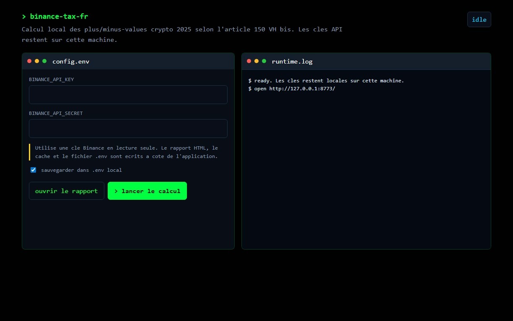

# Binance Tax FR : Calcul plus/moins-values crypto 2025

Script local Python qui calcule tes plus/moins-values crypto pour ta déclaration fiscale française 2025 (formulaire 2086) à partir de l'API Binance, selon la méthode officielle de l'article 150 VH bis du CGI.

> ⚠️ **Avertissement** : Ce rapport n'est **PAS un document fiscal officiel** ni opposable à l'administration fiscale. Il s'agit d'une aide au calcul. Pour un rapport certifié et opposable, utilise des services payants comme **Waltio** ou **Koinly**. Vérifie systématiquement les chiffres avant de les reporter dans ta déclaration.

---

## Prérequis

- **Python 3.9 ou plus récent**
  - macOS : `python3 --version`
  - Windows : `python --version` (depuis [python.org](https://www.python.org/downloads/), bien cocher *Add Python to PATH* à l'install)
  - Linux : `python3 --version`
- Un compte Binance avec accès à l'historique complet 2022–2025
- Aucun autre exchange ou wallet (sinon le calcul sera incomplet)

## Étape 1 : Créer une clé API Binance (lecture seule)

1. Connecte-toi sur [binance.com](https://www.binance.com)
2. Menu profil (en haut à droite) => **API Management**
3. Clique **Create API** => choisir **System generated**
4. Donne un label (ex : `tax-fr-readonly`) et valide avec ton 2FA
5. Une fois créée, clique **Edit restrictions** :
   - ✅ Coche UNIQUEMENT **Enable Reading**
   - ❌ Décoche tout le reste (Enable Spot Trading, Enable Withdrawals, etc.)
   - ✅ Restriction IP : recommandé (ajoute ton IP fixe si possible)
6. Sauvegarde ta `API Key` et ton `Secret Key` : le secret n'est affiché qu'une seule fois !

## Étape 2 : Configurer les clés

1. Dans le dossier du projet, copie `.env.example` vers `.env`
   - macOS / Linux : `cp .env.example .env`
   - Windows (PowerShell) : `Copy-Item .env.example .env`
2. Ouvre `.env` dans un éditeur de texte
3. Remplace `ta_cle_ici` et `ton_secret_ici` par tes vraies clés Binance
4. **Ne partage JAMAIS ce fichier `.env`** : il contient tes secrets

## Étape 3 : Installation

### macOS / Linux
Double-clique sur **`install.command`** dans le Finder (ou `./install.command` en terminal).

Si macOS bloque, fais clic droit => Ouvrir => confirme. Sinon en terminal : `chmod +x install.command run.command`.

### Windows
Double-clique sur **`install.bat`**.

L'installation crée un environnement Python virtuel (`venv/`) et installe les dépendances.

## Étape 4 : Lancer le rapport

- macOS / Linux : double-clique sur **`run.command`**
- Windows : double-clique sur **`run.bat`**

### Interface graphique Windows

Une interface graphique locale est disponible via **`run_gui.bat`** ou **`gui.py`**. Elle ouvre une page sur `127.0.0.1`, permet de saisir les clés Binance, de lancer le calcul, de suivre les logs en direct et d'ouvrir le rapport généré.

Pour créer un exécutable Windows autonome :

1. Double-clique sur **`build_exe.bat`**
2. Récupère **`dist\BinanceTaxFR.exe`**
3. Lance l'exécutable, renseigne tes clés API Binance en lecture seule, puis clique sur **`> lancer le calcul`**

L'interface reprend les codes PDS : fond terminal, JetBrains Mono si disponible, vert phosphore `#00FF41`, surfaces sombres et cartes terminales à coins francs.

Le script :
1. Récupère tout l'historique Binance depuis 31/01/2022
2. Récupère les prix EUR via les klines publiques Binance (peut prendre 1 à 2 min la 1ʳᵉ fois)
3. Applique la formule officielle française pour chaque cession SEPA EUR de 2025
4. Génère `rapport_fiscal_2025.html` et l'ouvre automatiquement

## Que faire avec le rapport ?

Le rapport HTML contient :
- Le détail des 6 cessions SEPA 2025 => à reporter dans le **formulaire 2086**
- Le total plus-values => case **3AN** du formulaire **2042 C**
- Le total moins-values => case **3BN** (reportables 10 ans)
- Liste des actifs au 31/12/2025

**Ne pas oublier** :
- ✅ Cocher la case **8UU** sur le formulaire 2042 (compte d'actifs numériques à l'étranger)
- ✅ Remplir un formulaire **3916-bis** par compte étranger (= 1 pour Binance)

Pour imprimer en PDF : ouvre le fichier HTML dans un navigateur => `Ctrl/⌘ + P` => Enregistrer en PDF.

---

## Sécurité

- Les clés API restent en local, dans `.env` (jamais envoyées ailleurs)
- L'API Binance est appelée en **lecture seule**
- Les prix historiques viennent des klines publiques Binance (pas de clé tierce)
- Aucun envoi de données vers un serveur tiers

## Dépannage

- **"Invalid API-key"** : vérifie le contenu de `.env`, et que la clé est bien activée côté Binance
- **`python` non reconnu (Windows)** : réinstalle Python depuis python.org en cochant *Add Python to PATH*
- **Rate limit Binance** : le script gère et attend automatiquement, relance si nécessaire (un cache local est utilisé)
- **Aucune cession trouvée** : vérifie que tu as bien fait des retraits SEPA en 2025 sur Binance

## Limites

- Couvre uniquement Binance. Si tu as d'autres wallets, le calcul est faux.
- Ne gère pas les airdrops, NFT, futures, marges, etc.
- Si un token n'est plus listé / a été renommé sur Binance, il peut être ignoré (avertissement affiché ; ex : MATIC renommé POL en sept. 2024).

Pour un rapport officiel et exhaustif, **recommandation** : [Waltio](https://www.waltio.com) ou [Koinly](https://koinly.io).
